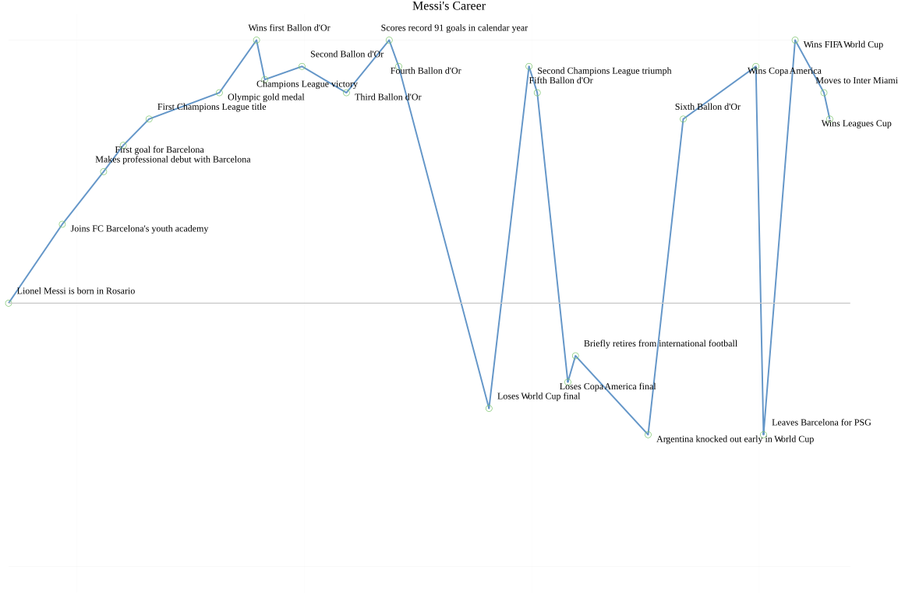
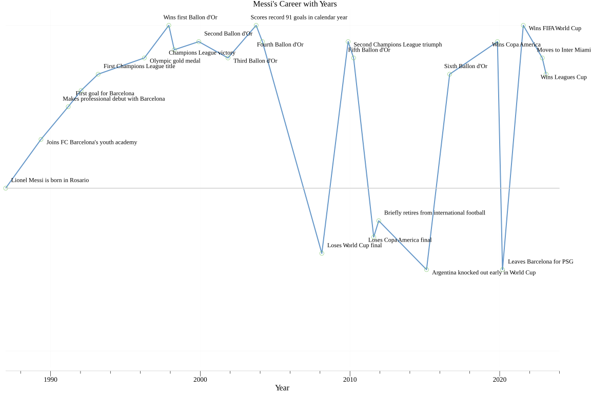

# Life Line

A Go application that creates BEAUTIFUL timeline visualizations from CSV data, featuring intelligent density-based spacing and customizable display options. This is 95% generated by AI :) Vibing Hard 🤙🤙🤙

## Features

- 📊 **Density-Based Spacing**: Automatically gives more visual space to time periods with many events
- 🔄 **Smart Event Spacing**: Handles multiple events in the same year with automatic positioning
- 🏷️ **Intelligent Labels**: Alternating label positions to minimize overlap
- 🎨 **Clean Visual Design**: Light blue connecting line with minimalist styling
- 🚩 **Optional Year Display**: Toggle x-axis years on/off with command-line flag
- 📈 **Flexible Data**: Supports any timeline data with year, value, and optional labels

## Installation

1. Make sure you have Go installed (version 1.19 or later)
2. Clone or download this repository
3. Install dependencies:
   ```bash
   go mod tidy
   ```

## Usage

### Basic Usage

```bash
go run main.go input.csv output.png
```

### With Year Labels

```bash
go run main.go -years input.csv output.png
```

### With Custom Title

```bash
go run main.go -title "Messi's Career" examples/messi_example.csv examples/messi_lifeline.png
```

### Combined Options

```bash
go run main.go -years -title "My Professional Journey" timeline.csv career_timeline.png
```

### Help

```bash
go run main.go -h
```

## Input Format

Create a CSV file with the following format:

```csv
1987,0,Lionel Messi is born in Rosario
2000,3,Joins FC Barcelona's youth academy
2004,5,Makes professional debut with Barcelona
2005,6,First goal for Barcelona
2009,10,Wins first Ballon d'Or
2009,8,Champions League victory with Barcelona
2012,10,Scores record 91 goals in calendar year
2015,9,Second Champions League triumph
2016,-3,Loses Copa America final with Argentina
2021,10,Wins Copa America with Argentina
2021,-5,Leaves Barcelona for PSG
2022,10,Wins FIFA World Cup with Argentina
2023,8,Moves to Inter Miami
```

### CSV Fields

- **year** (required): The year when the event occurred (can be decimal for sub-year precision)
- **value** (required): A numeric value representing the significance or impact (-10 to +10 works well)
- **label** (optional): A descriptive text for the event. If omitted, defaults to "year, value"

## Output

The tool generates high-quality PNG images (12" × 8") suitable for:

- Personal timeline visualization
- Life story presentations
- Portfolio or resume graphics
- Social media sharing

## Advanced Features

### Automatic Density Scaling

The tool automatically detects areas with high event density and gives them proportionally more horizontal space:

- **Low Density (2-4 events)**: Minimal scaling
- **Medium Density (5-7 events)**: Moderate expansion
- **High Density (8+ events)**: Maximum expansion (up to 80% more space)

### Same-Year Event Handling

When multiple events occur in the same year, they are automatically spaced with small decimal offsets:

- 2 events: positioned at -0.1 and +0.1 from the original year
- 3 events: positioned at -0.2, 0.0, and +0.2 from the original year
- And so on...

### Label Positioning

Labels use an intelligent alternating pattern to minimize overlap:

- Position 1: Top-right of point
- Position 2: Bottom-right of point
- Position 3: Top-left of point
- Position 4: Bottom-left of point
- Pattern repeats...

## Command-Line Options

| Flag                    | Description                                     | Default          |
| ----------------------- | ----------------------------------------------- | ---------------- |
| `-years`                | Show years on x-axis with tick marks and labels | `false`          |
| `-title "Custom Title"` | Set custom title for the timeline               | `"My Life Line"` |
| `-h`                    | Show help information                           | -                |

## Examples

### Default Timeline

```bash
go run main.go personal_data.csv my_timeline.png
```

Creates a clean timeline with default title "My Life Line", focused on events without year distractions.

### Timeline with Years and Custom Title

```bash
go run main.go -years -title "Messi's Career" examples/messi_example.csv examples/messi_timeline_with_years.png
```

Creates a timeline with year references and custom title, suitable for resumes or academic presentations.

### Sample Output

The repository includes example output for Lionel Messi's career timeline:

**Clean Timeline (no years):**


**Timeline with Years:**


These examples demonstrate the density-based spacing algorithm working with Messi's peak years (2008-2016) getting expanded visual space, while early career and recent events maintain natural spacing.

## Debugging

The tool provides detailed debugging output showing:

- Same-year adjustments made
- Density calculations for each event
- Before/after positions for density scaling

This information helps you understand how the automatic spacing algorithms are working.

## Tips for Best Results

1. **Value Range**: Use values roughly between -10 and +10 for best visual balance
2. **Event Density**: The tool works best with 15-30 events total
3. **Label Length**: Keep labels concise (under 40 characters) for better readability
4. **Chronological Order**: Events don't need to be pre-sorted; the tool handles this automatically

## Technical Details

- Built with Go and the [Gonum Plot](https://pkg.go.dev/gonum.org/v1/plot) library
- Uses density-based scaling with a 3-year sliding window
- Implements chronological order preservation
- Supports PNG and SVG output formats (PNG recommended)

## File Structure

```
lifeline/
├── main.go                      # Main application code
├── examples/                    # Example files directory
│   ├── messi_example.csv        # Example input data (Messi's career)
│   ├── messi_lifeline.png       # Example output (clean timeline)
│   └── messi_lifeline_with_years.png # Example output (with years)
├── input.csv                    # Your personal input data (gitignored)
├── output.png                   # Your generated timeline (gitignored)
├── go.mod                       # Go module definition
├── go.sum                       # Go module checksums
├── .gitignore                   # Git ignore file
└── README.md                    # This file
```

## Contributing

This is a personal project, but feel free to fork and modify for your own timeline visualizations!
